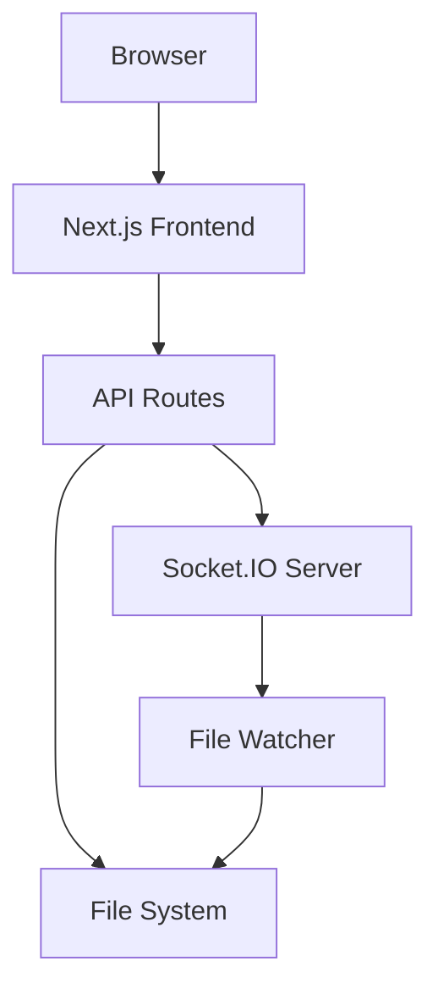
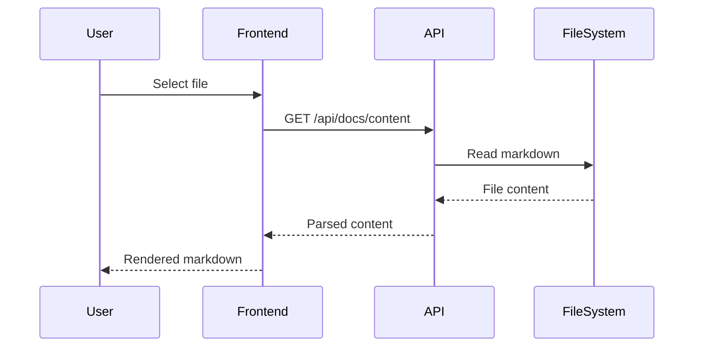
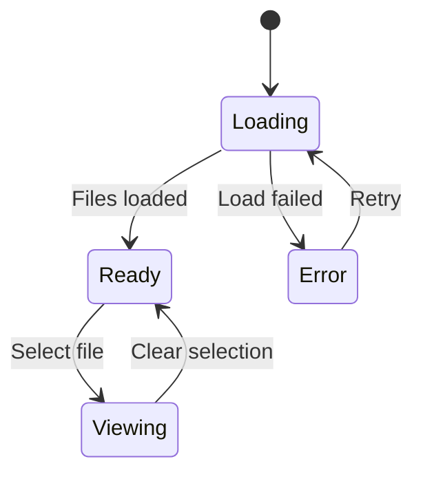

# Welcome to Smart Docs

This is a test documentation file to demonstrate the Smart Docs viewer.

## Features

- **Markdown rendering** with syntax highlighting
- **Claude Code integration** - view skills, commands, agents, and hooks
- **Plugin management** - enable/disable plugins per project

## Code Example

```typescript
function hello(name: string): string {
  return `Hello, ${name}!`;
}
```

## Architecture



## Request Flow



## State Diagram



## Next Steps

- Check out the Claude Config tab to see your Claude Code setup
- Visit the Plugins tab to manage your installed plugins
